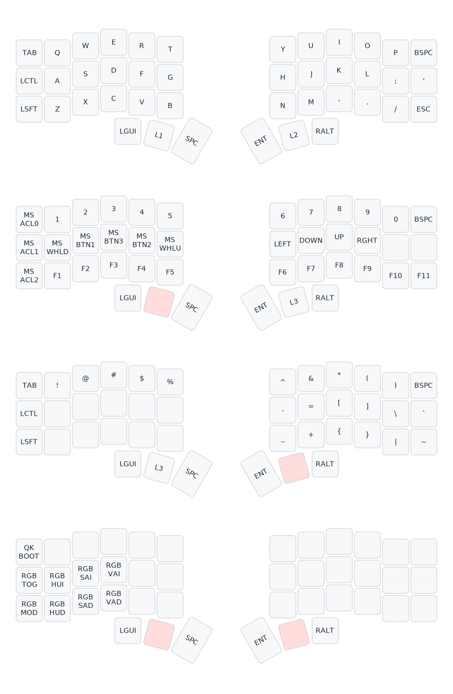

# QMK Userspace

This is a template repository which allows for an external set of QMK keymaps to be defined and compiled. This is useful for users who want to maintain their own keymaps without having to fork the main QMK repository.

This is tailored for my usage and my keyboards

### Workflow (GitHub actions 🚀)
If you are interested, then i made a custom job to generate the current layout of keyboards by pushing to the branch

